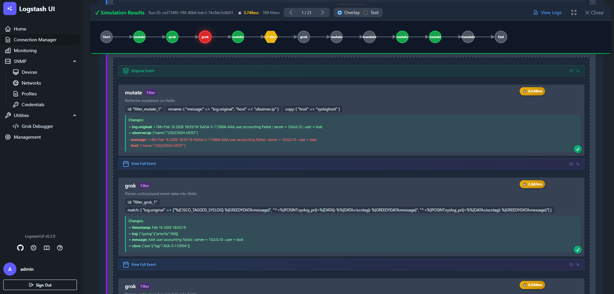
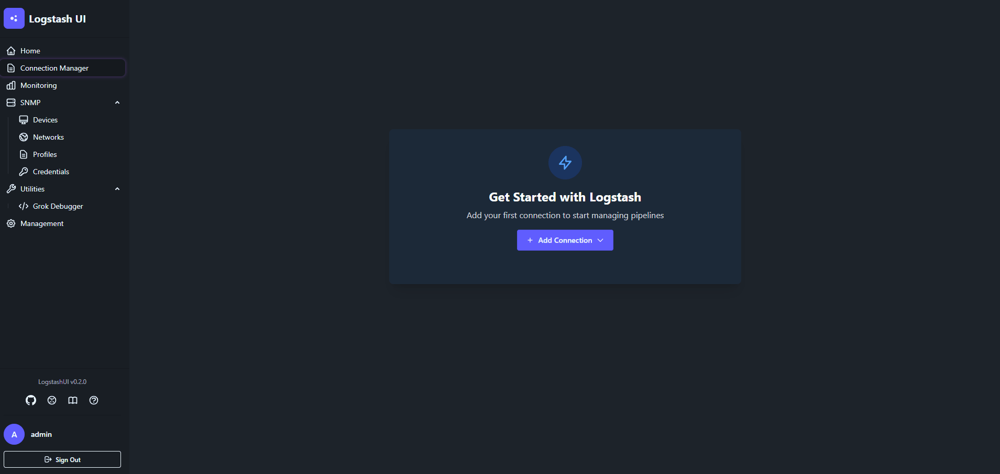
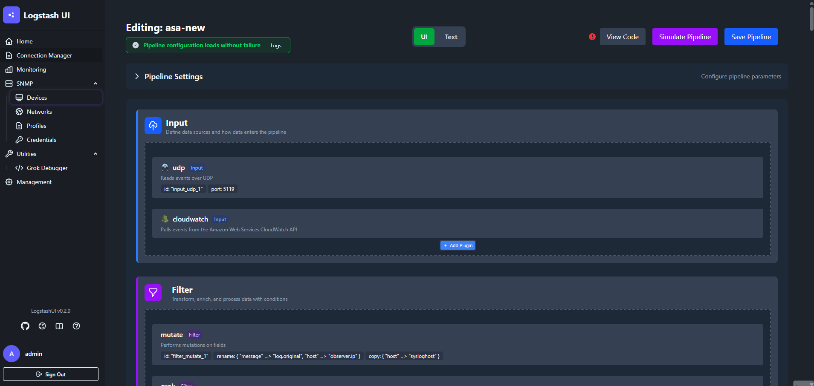
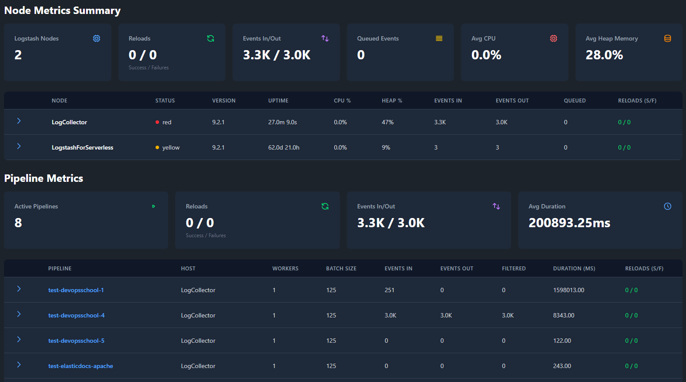

# LogstashUI

> A visual tool for authoring, simulating, and managing Logstash pipelines.
> 
> ⚠️ **Beta Release** - This project is under active development. Features may change.



## Overview

LogstashUI provides a visual interface for designing, testing, and operating Logstash pipelines.

Instead of editing configuration files manually, pipelines can be authored visually, simulated against sample events, and deployed to multiple Logstash nodes from a single interface.

## Features

- **Visual Pipeline Editor** — Build and modify Logstash pipelines using a graphical interface or raw configuration
- **Pipeline Simulation** — Execute pipelines against sample events and inspect transformations step-by-step
- **Multi-Instance Management** — Manage pipelines across multiple Logstash nodes using Centralized Pipeline Management
- **Pipeline Monitoring** — View metrics and performance for running pipelines
- **SNMP Support** — Configure polling, traps, and discovery through a web interface


## Requirements

### System Requirements
**Minimum:**
- 4 GB RAM
- 2 CPU Cores

### For Local Development
- [Python 3.10+](https://www.python.org/downloads/)
- [Node.js & npm (for building Tailwind CSS assets)](https://nodejs.org/en/download)
- [Elasticsearch 8.x or later](https://cloud.elastic.co)
- [Docker](https://www.docker.com/get-started/)


## Quick Start

Run LogstashUI with Docker compose:

```bash
git clone https://github.com/elastic/LogstashUI.git
cd LogstashUI
docker compose up -d
````

Once the containers are running, navigate to your host in your browser:

https://<your_server_ip_or_hostname>

And that's it!

---
## Add Your First Connection

### 1. Create an initial user


### 2. Add a connection


### 3. Start managing pipelines!



### Optional: Add monitoring to your connections:
Use [this guide](https://www.elastic.co/docs/reference/logstash/monitoring-with-elastic-agent) to set up the Elastic Agent's Logstash integration. Once Logstash monitoring data is indexed into Elasticsearch, metrics and logs will appear in the UI.



## Updating

LogstashUI will notify you when a new version is available via a banner in the navigation sidebar:

To update LogstashUI to the latest version:
```bash
git pull
docker compose down
docker compose pull
docker compose up -d
```


Your data (database, configurations) persists in Docker volumes, so it won't be lost during updates.

## Limitations
- Currently, the translation engine cannot process comments inside plugin blocks. For example:

```
input {
    udp { # Translation engine doesn't like this
		port => 5119 # This is a comment that we can't convert
	}
}
```

## Roadmap
- Reusable grok and regex patterns
- Git backups for configuration
- Loggy AI Assistant for pipeline failure analysis
- Management of Logstash Nodes via external agent
- Logstash Keystore management
- Expression editor for conditions

## Reporting Issues

Found a bug or have a feature request? [Open an issue](https://github.com/elastic/LogstashUI/issues/new?template=issue.md).

## Contributing

Contributions are welcome!

Please open an issue to discuss large changes before submitting a pull request.

## License

Copyright 2024–2026 Elasticsearch and contributors.

Licensed under the Apache License, Version 2.0. See [LICENSE](LICENSE.txt) for details.