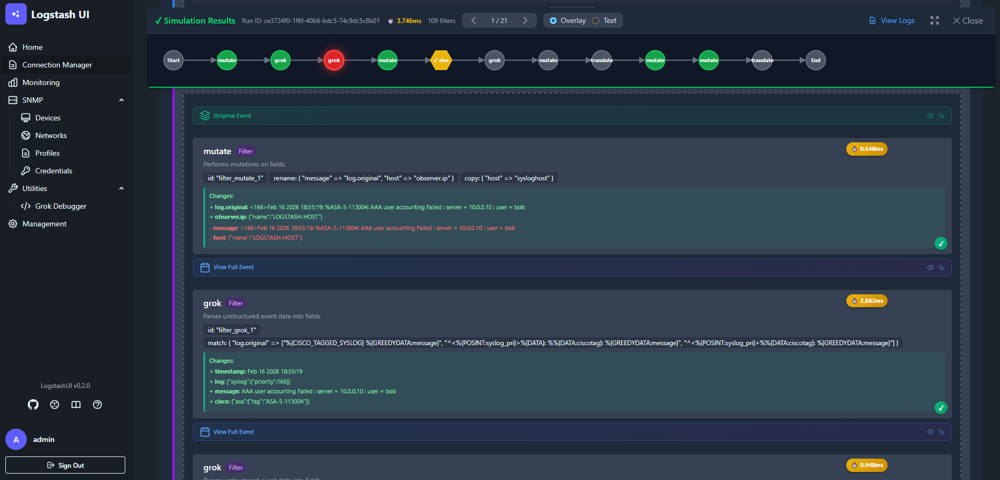
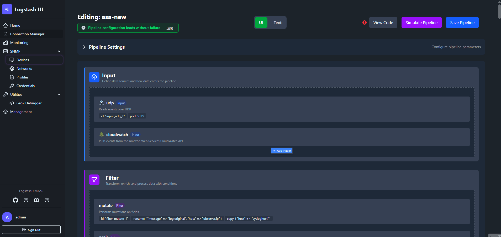
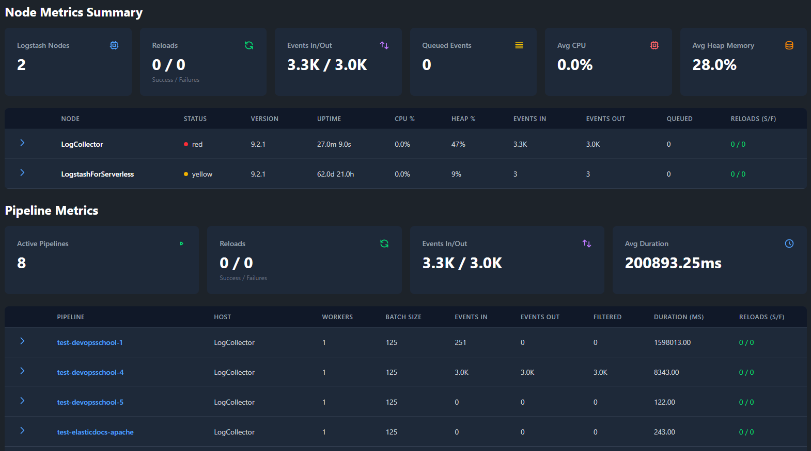
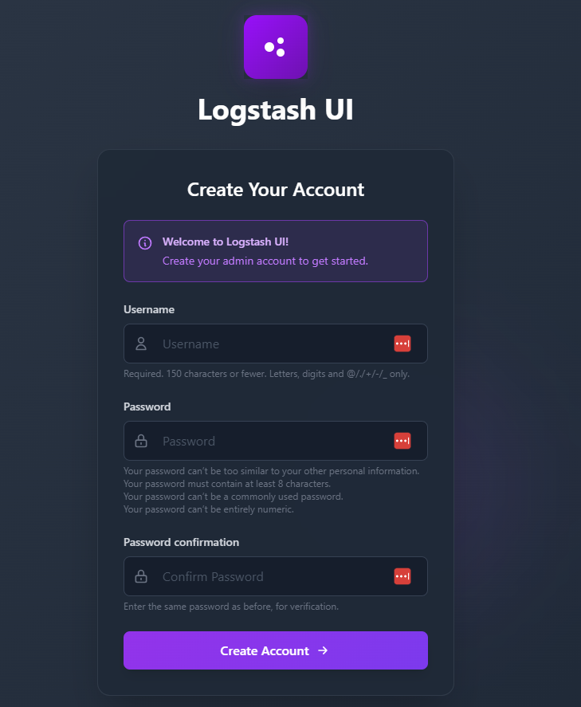
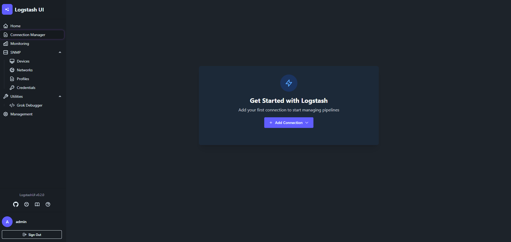

# LogstashUI

> A control plane and visual editor for Logstash, built for managing Logstash nodes and authoring, simulating, and deploying pipelines.
> 
> ⚠️ **Beta Release** - This project is under active development. Features may change.
>
> **Current package version: 0.5.2** — see [CHANGELOG.md](CHANGELOG.md). Pair with **LogstashAgent 0.5.2**. Operator guide: [agent roles / ports / coexistence / VERSION](docs/docs/logstashagent/general/roles.md).



## Overview

LogstashUI provides a visual interface for designing, testing, and operating Logstash pipelines.

Instead of editing configuration files manually, pipelines can be authored visually, simulated against sample events, and deployed to multiple Logstash nodes from a single interface.

## Features

<details>
    <summary><b>Control Plane for Logstash</b> — Centrally manage Logstash nodes with Centralized Pipeline Management and Logstash Agent</summary> 

 
</details>

<details>
    <summary><b>Visual Pipeline Editor</b> — Author pipelines in three modes: an inline graphical interface, raw text editor, and a full visual graph for building pipelines by connecting nodes. Switch between modes seamlessly on any pipeline.</summary>

 
</details> 

<details> 
    <summary><b>Pipeline Simulation</b> — Execute pipelines against sample events and inspect transformations step-by-step</summary> 
    
 
</details>

<details>
    <summary><b>Monitoring</b> — View metrics and performance for running pipelines and Logstash nodes</summary>
    

</details>

<details>
<summary><b>SNMP Pipeline Management</b> — Configure polling, traps, discovery, credentials, devices, networks, and profiles through the UI.</summary>


</details>

---

## Documentation

- **[Architecture](docs/docs/logstashui/architecture.md)** - System architecture and component overview
- **[LogstashUI Documentation](docs/docs/logstashui/index.md)** - Installation, configuration, and usage guides for LogstashUI
- **[SNMP Monitoring](docs/docs/logstashui/SNMP/index.md)** - Network monitoring with polling, traps, and discovery
- **[LogstashAgent Documentation](docs/docs/logstashagent/index.md)** - Setup and configuration for LogstashAgent

---

## Requirements

### System Requirements
**Minimum:**
- 8 GB RAM
- 4 CPU Cores

**Why these requirements?**

LogstashUI can run on smaller instances for light usage, especially when only using the editor or basic configuration workflows. The minimum requirements above are intended to provide a reliable baseline for common usage and heavier operations like pipeline simulation and multiple instances of Logstash Agent.

If you choose to run LogstashUI with fewer resources, it will likely work fine, but performance can vary depending on the operation. If the UI feels slow, simulations take too long, or agent operations appear delayed, increase CPU and memory before troubleshooting further.

## How to Deploy

The **[Deployment Guide](docs/docs/logstashui/general/deploy.md)** covers the ways you can deploy LogstashUI — the standard Docker install, host-backed simulation, and running from source.

If you have internet access and can use Docker and GitHub, the standard install is below in the Quick Start section.

---

## Quick Start - Embedded Mode
> [!TIP]
> For heavy simulation, prefer [enrolled simulate agents](docs/docs/logstashui/configuration/host_mode.md) (isolated `simulate-N` instances). `simulation.mode: host` in start scripts is a **legacy** local path.
### Download LogstashUI
```bash
git clone https://github.com/elastic/LogstashUI.git
cd LogstashUI/bin
```

### Run LogstashUI
#### Linux
```cmd
./start_logstashui.sh
```

#### Windows
```cmd
start_logstashui.bat
```

Once the containers are running, navigate to your host in your browser:

https://<your_server_ip_or_hostname>

And that's it!

---
## Add Your First Connection

### 1. Create an initial user


### 2. Add a connection


### 3. Start managing pipelines!


### Optional: Add monitoring to your connections:
Use [this guide](https://www.elastic.co/docs/reference/logstash/monitoring-with-elastic-agent) to set up the Elastic Agent's Logstash integration. Once Logstash monitoring data is indexed into Elasticsearch, metrics and logs will appear in the UI.


## Updating

LogstashUI will notify you when a new version is available via a banner in the navigation sidebar:

To update LogstashUI to the latest version:

> [!WARNING]
> `--update` switches the repository to the `main` branch before pulling the latest code and images.

#### Linux
```bash
cd LogstashUI/bin
./start_logstashui.sh --update
```

#### Windows
```cmd
cd LogstashUI\bin
start_logstashui.bat --update
```

## Limitations
- Comments inside plugin blocks (inline and standalone) are preserved through parsing and serialization, but their exact position relative to config keys is not guaranteed. All comments are grouped at the top of the plugin block in the output.

```
input {
    udp { # inline comments are moved
        port => 5119 # inline comments are moved
    }
}
```

Becomes:

```
input {
    udp {
        # inline comments are moved
        # inline comments are moved
        port => 5119
    }
}
```


## Reporting Issues

Found a bug or have a feature request? [Open an issue](https://github.com/elastic/LogstashUI/issues/new?template=issue.md).

## Contributing

Contributions are welcome!

Please open an issue to discuss large changes before submitting a pull request.

## License

Copyright 2024–2026 Elasticsearch and contributors.

Licensed under the Elastic License 2.0 (ELv2). See [LICENSE](LICENSE.txt) for details.